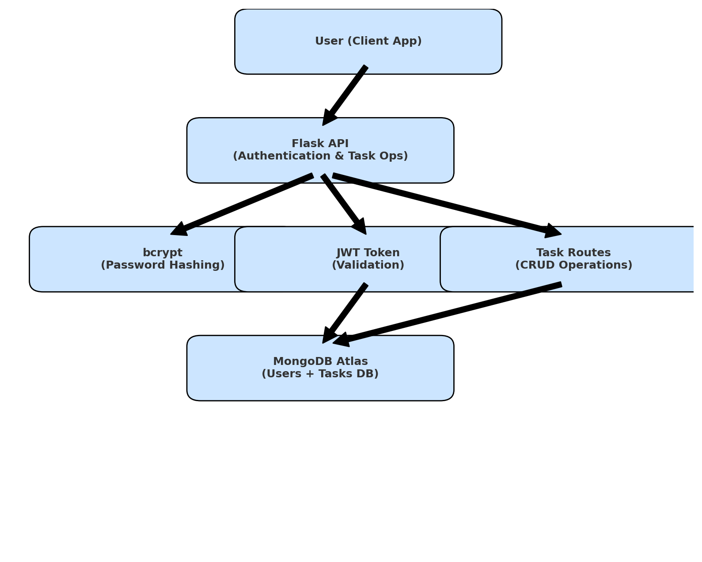
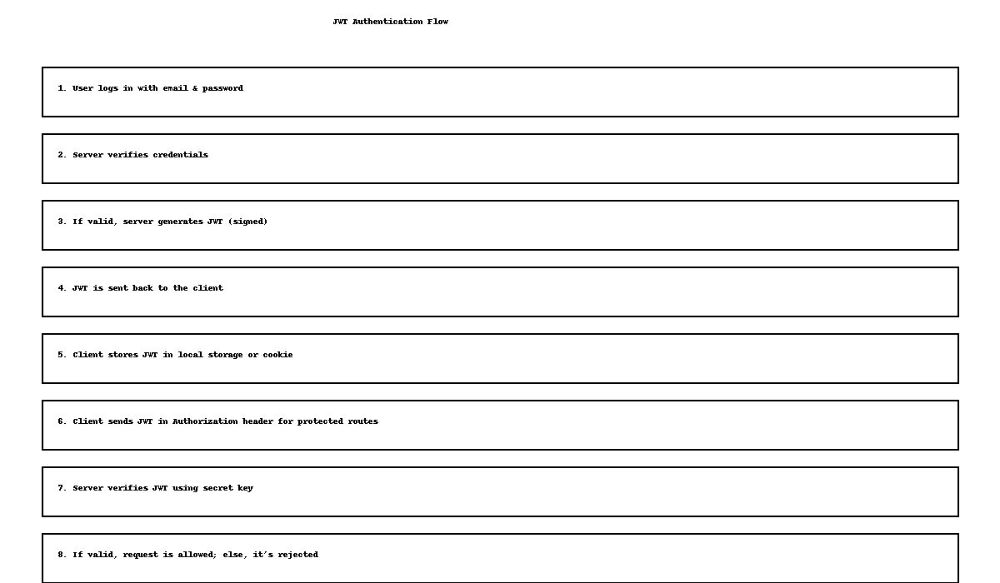

# Secure-Task-manager
📌 Secure Task Manager API

A secure and scalable RESTful API for task management, built with Flask, MongoDB, JWT authentication, and bcrypt hashing. This project ensures that user data and tasks remain private and protected while enabling efficient task creation, retrieval, update, and deletion.

🧩 Problem Statement

In the current digital age, managing tasks securely is a necessity for both individuals and organizations. However, many task management tools either:
* Lack proper authentication mechanisms,
* Do not protect user data,
* Or are difficult to scale and maintain.
This project addresses the above problems by building a secure, scalable, and RESTful Task Manager API with token-based authentication and encrypted data handling.

🛠️ Tools & Technologies Used


| Tool/Library   | Purpose                                           |
|----------------|---------------------------------------------------|
| Flask          | Python web framework for building the REST API    |
| MongoDB        | NoSQL database to store users and tasks           |
| PyJWT          | To implement JWT-based authentication             |
| bcrypt         | For securely hashing user passwords               |
| PyTest         | For unit testing                                  |
| Swagger UI     | API documentation                                 |
| Git & GitHub   | Version control and collaboration                 |
| Postman        | API testing                                       |

🔒 Architecture Overview





Diagram Description:

*Users register and log in → receive a JWT token

*All future API requests use this token in headers (Authorization: Bearer <token>)

*Routes are protected using decorators

*Tasks are CRUD-operated by authenticated users only

*Passwords are hashed before storing

📂 Folder Structure


```
SecureTaskManager/
├── app/
│   ├── __init__.py
│   ├── auth.py           # Registration and login logic
│   ├── routes.py         # Task CRUD routes
│   ├── utils.py          # JWT and auth decorators
│   ├── tests/
│   │   └── test_auth.py  # Unit tests for authentication
│   └── .env              # Secret keys and database URI
├── requirements.txt      # Project dependencies
├── run.py                # Main entry point
└── README.md             # This file
```

🚀 Features

✅ JWT-based secure login and registration

✅ Task management (Create, Read, Update, Delete)

✅ Bcrypt-encrypted password storage

✅ Protected routes using decorators

✅ Organized and scalable codebase

✅ Swagger UI for API documentation


🔐 JWT Authentication Flow





Flow Summary:


*User registers with email and password

*Password is hashed using bcrypt

*On login, password is verified and JWT is issued

*JWT is used to authorize access to protected task routes


📘 API Endpoints Summary

Endpoint	     Method	   Access	     Description

/register      POST	     Public	     Register a new user

/login	       POST	     Public	     Login and receive JWT token

/tasks	       GET	     Private	   Get all tasks for user

/tasks	       POST	     Private	   Create a new task

/tasks/<id>	   PUT	     Private	   Update a task

/tasks/<id>	   DELETE	   Private	   Delete a task


🔬 How to Run the Project

1. Clone the Repository

```bash
git clone https://github.com/Ritikayogi/Secure-Task-manager.git
cd Secure-Task-manager
```

---

2. Create a Virtual Environment

```bash
python3 -m venv .venv
source .venv/bin/activate
```

---

3. Install Dependencies

```bash
pip install -r requirements.txt
```

---

4. Add Environment Variables

Create a `.env` file in the root directory and add:

```env
SECRET_KEY=your_secret_key
MONGO_URI=mongodb://localhost:27017/taskdb
```

---

5. Run the Application

```bash
python run.py
```

---

6. Test API using Swagger or Postman

Open in your browser:

```
http://localhost:5000/docs
```

---

🧪 Running Tests

To run all unit tests using PyTest:

```bash
pytest
```


    
📌 Contributions

This project was made with a strong focus on:

- Clean code and modular design  

- Reusability and scalability  

- Security-first development  


  
Contributions welcome!


🙌 Special Thanks

Thanks to the open-source community and Flask documentation for all the inspiration and support during development.


